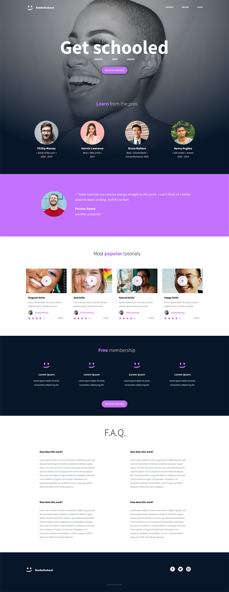

# CSS Advanced

This project is part of the Holberton School Web Development curriculum and builds on the HTML Advanced project to style a complete Smile School landing page.
The goal is to reproduce the Figma design using advanced CSS techniques such as selectors, CSS variables, floats, typography, background images, and form styling.
Throughout the tasks, you will progressively transform the unstyled HTML structure into a polished, responsive web page that matches the designer file.

## Learning Objectives

- Selectors, properties, and values
- The difference between block and inline styling
- How to ensure consistency across all browsers (CSS reset)
- How to set up CSS variables
- The differences between inline, embedded, and external CSS
- How grid systems work (with floats)
- The difference between icons, webfonts, and SVG icons
- The difference between pseudo-classes and pseudo-elements
- How to make background gradients
- How to animate and transform elements in CSS
- What vendor prefixes are

## Resources

- [Page in Figma](https://www.figma.com/file/hcxMqRWjdj06jHycRkbzOf/Homepage)
- Fonts: [Source Sans Pro](https://fonts.google.com/specimen/Source+Sans+Pro) and Spin-Cycle-OT
