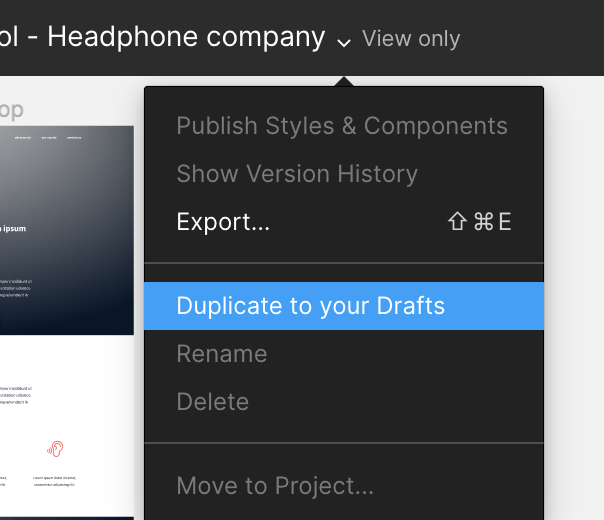

# HTML Advanced

This project is the first step in building a webpage from a designer file using only semantic HTML.  
The goal is to understand how to structure a modern webpage correctly without using CSS, JavaScript, or inline styles.  
The project focuses on creating a clean, accessible, and meaningful HTML structure based on the provided Figma design.

## Design

The webpage is based on the following Figma design:



## Technologies

- HTML5
- Semantic HTML
- Figma design reference

## Project Structure

```text
html_advanced/
└── task_0/
    └── README.md
    